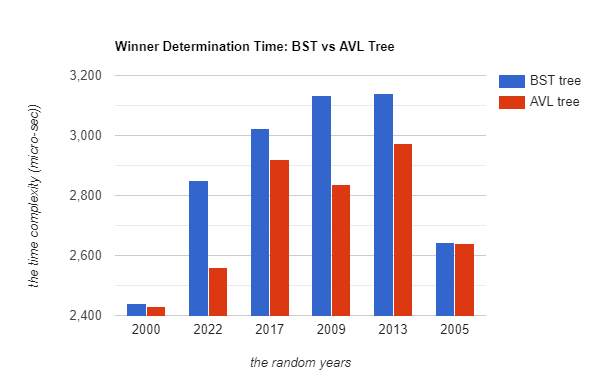

# ASMP
This repository contains the source code of the ASMP (**Agricultural Production Management System**), provided is a detailed explanation of the problem statement and the proposed solution which addresses the problem using different data structures, including the approach, methodology, and any relevant complexities.

## What is ASMP?
ASMP stands for **Agricultural Production Management System**, a software solution implemented entirely in **C++** to enhance data collection, analysis, and decision-making in the agricultural field in Algeria, making these processes more efficient and sustainable.

The system was developed as part of the final project for the Data **Structures and Algorithms 2** course. We were given approximately two months to design and implement the system, utilizing various data structures taught in the course. These data structures include, but are not limited to, hash tables, linked lists, binary search trees, and vectors.

The solution was designed to improve agriculture in Algeria, and it is developed to receive data related to Algerian cities. However, it can be easily adjusted and scaled to handle data from other countries by simply providing the relevant data for the desired country.

Overall, we were required to implement our solutions in two different parts, the first part should make used of Binary Search Trees, and the second part of the solution should include AVL trees, and finally compare the efficiency of both versions of the solution to establish the efficiency and performance of solutions that are based on balanced trees.
Please make sure to check [the detailed project statement](/DSA%202%20mini%20project_Agriculture%20Production%20management%20system.pdf) continue reading this README file for more details about the system's design and implementation choices.

## Problem Statement:
Across many countries in the world, the Ministry of Agriculture lacks a centralized system for managing critical agricultural production data. The APMS project seeks to address these issues by creating a robust and scalable system that facilitates the following functions:

* Farmer registration and data management (farmer ID, land information, SSN, name, gender, age, number of helpers)
* Tracking of farm sales data (category, month/year, average price, quantity sold, penalty, electricity/water consumption)
* Geolocation of farms through integration with Algerian city data (Wilaya, area, farmer ID)
* Analysis of farmer performance and identification of best practices in order to find the winner farmer nationally in each month in each year .( monthly awards for the most efficient farmer ) .

## Data Description:
In order to test the efficiency of our system and evaluate the performance of the algorithms, we generated random data using Python's Faker library. The solution is based on three different data sources:
  * **Farmer Data** (a csv file named "farmer.csv"): Contains information about individual farmers, including their ID, Area’s ID, SSN, full name, gender, age, and the number of people who assist them , this dataset contains 200 000 instances .
  * **Sales Data** (a csv file named "sales.csv"): Records farm sales data in a specialized category , it include : farmer ID, category, month/year, average price, quantity sold (in kgs), penalty ( 1 ,2 or 3 ), electricity consumption, and water consumption  , it contains 1 000 000 instances (one million record).
  * **Algerian City Data** (a csv file): Integrates farmer location information by linking Wilaya ( using its ID from 1 to 58 ) and area with corresponding farmer IDs.

## Our proposed Solution:
Our solution makes use of two separate tree structures to efficiently manage data. Each node within these trees has the year as a data member,  and a vector of size 12, where each element corresponds to a specific month in that year. 

 

The first tree, called the "Winners Tree," is where all of the winners from each category are kept. The winning ID and the computed formula for the winners are stored within the vector box corresponding to each month. This structure makes it possible to identify winners quickly by a simple tree traversal and then analyzing the box for the relevant month in the vector in a worst case time complexity of O(logN) where N is the number of years where it is assumed to be as large or less than 32.
 
 
 
 

 
 
 
 

The second tree, aptly named the "Sales Tree," is dedicated to organizing sales data,The vector element for each month utilizes a hash table to efficiently store sales structures for all categories and farmers, this ensures that the operation of accessing the sales of a specific farmer (given the farmer’s ID) when the tree node is known takes a worst-case time complexity of O(1).
Individual farmer data is maintained within a hash table that holds the Farmer structures. This structure guarantees O(1) access to personal information during report generation.
 
 
 
 

 
 
 
 

**Legend:**
 

*figure 1:* Represents the Winner Tree class
 

*figure 2:* Represents The year-Sales tree where each node of the tree holds a hash table for the sales in this specific year
The solution functions as intended and executes efficiently. As shown below : 
 
 
 
 

 
 
 
 

 
 
 
 

 
 
 
 

## Description of the complete specifications of the ADTs used in the implemented solution:
### 1. The winners Tree: (please refer to fig1 for a better understanding)
The data structures used in the data structures used in the winners tree include: winnerCategory , winner_node , winnertree 
The functions used:
   * **update_winner()** : This function  is called when a new sale is recorded , it receives an instance of the sale structure and updates or inserts winner information for the associated farmer.
   * **find_winner functions**: the solution implements three primary functions which operate on the binary search tree containing winners information, following is the time complexity for each function:
      * __Find_winner_by_year_month__ : operates in O(log(t)) 
      * __Find_winner_by_year__ : runs in O(k log(t))
      * __Find_winner_by_month__ : runs in O(t)
   * **calculate_formula():** serving the critical role of determining the winner for each category. It achieves this by evaluating a predefined formula based on specific properties associated with each farmer (profits , water consumption … ). This formula-based approach allows for an objective and consistent selection process , ensuring that the winners are identified based on fair and  pre-established criteria. Time complexity : O(1)

### 2. Year Sales Tree: (please refer to fig2 for a better understanding)
The data structures used are: yearSales (struct),  BinaryNode (struct)  , bst_Year(A binary search tree that stores information about the farmers' sales in the months of the years implemented as a **class** )
The functions used are:
   * **insertSales():** This function is called to record the instance of the sales class in the bst_year tree. 
   * **Report Functions:** it contains:
     * **reportSales():** operates in O(1), it reads from the hash table to report a sale of a given farmer in a given month and year
     * **reportPenalties():** operates in O(log(t)) where  t  : is the number of years
     * **Penalty_farmers_wilaya():** :  runs in O(k.log(t)) where k is a constant
     * **Penalty_farmers_city()** : runs in O(k.log(t)) where k is a constant
     * **reportArea()** : it gives the area’s sales in a worst time of O(k.log(t)) where k is a constant
     * **reportCity():** it gives the city’s sales in a O(k.log(t)) where k is a constant
     * **reportWilaya():** it gives the wilaya’s sales in a O(k.log(t)) where k is a constant
     * **reportCountry():** it gives the country's sales in a O(k.log(t)) where k is a constant
     * **reportFarmer():** runs in O(1) by reading from the hash table knowing the ID of a farmer 
**Note**: k in this case is a constant that does not depend on the input size (1.000.000 instances)

### 3. Sales Hash Table:
to find the sales of any farmer we store the sales in a hash table to make the access of the sales easier in a O(1), and the access will be based on the ID_farmer.
The data structures used are: category(struct) , Sales (struct) , SaleHashTable(class)
The functions used are:
  * **insert():** inserts the element (sale) inside the hash table using the ID_farmer. The running time complexity is O(1).
  * **getSales():** returns the element (sale) from the hash table and takes a (key) variable as argument which represents the ID_farmer(the access is using the ID_farmer). The running time is O(1).
  * **Other functions:** contains, insert ,remove , getSales , findPos , Active , myhash

### 4. Farmer Hash Table:
to find the framers corresponding to each area where the areas follow a city and the cities follow a Wilaya, we store the wilayas in a linked list. The wilayas array is implemented in a way that makes it able to store a linked list of cities, the latter stores a linked list of areas which in turn stores a linked list of farmers IDs.
The data structures used are:  
  * **yearSales class:** is a linked list of wilayas that stores a linked list of cities which stores a linked list of areas, the latter stores a linked list of farmers IDs, where we can access all the farmers using the farmers IDs in a specific area and we can access the areas in specific city using the area's IDs and we can access all the cities in specific Wilaya using the Algerian numbering system of wilayas (1-58)
  * **farmer:**  is a struct that stores all the information about the farmer : the farmer_Id (long) ,farmer_area(int),
 farmer_SSN(long),farmer_fullName(string),farmer_gender(string) /Male or Female/ , farmer_age(int), nb_helpers(int) 
 represents the number of helpers of the farmer.

The function used :
  * **init():** the most critical function in the solution's implementation, it reads lines from the file(file_path), extracts Wilaya, city, and area as strings , it takes time complexity O(n) , n represents the number of lines in the file, in our case it is 200,000.
  * **printWilayas()**: runs in a time complexity of O(n)  where n represents the number of wilayas.
  * **printCities()**: takes a time complexity of O(n) where n represents the number of cities in a given Wilaya.

**Note:** 
* In both hash tables, the quadratic probing scheme is used for its efficiency in the execution time and collisions handling.
* For all the structures and the classes implemented in our proposed solution, the following was done:
  * Setters and Getters were implemented so that we can get the data and manipulate it within the data structures
  * The operators << , == , != were overloaded in order to print, compare data instances.
  * The **big Five** were also developed for each data structure, those are the constructor, copy constructor, copy assignment, move assignment, and the destructor

## Vizualisation:
To help users analyze and vizualise the performance of our proposed solution, we have included dynamic graph generation at runtime. Namely, we have included the following two functions:
  * **generateSalesBarChart()** : for generating a bar chart representing the sales of a given farmer in all the five categories on a specific month and year, below is a sample result of the function:
  
  * **generateRunningTimeGraph()** : to Generate a graph for the running time of inserting a sale based on the input size 
* The vizualisation is done through matplotlib, python's most widely used library for plotting, there is a complete [setup guide](./Matplotlib%20setup_%20Installation%20and%20compilation%20walkthrough%20in%20C++_.pdf) that will walk you through all the steps required to be able to use its functionalities from C++

## Comparative analysis between the first part (using BSTs) and the second part (AVL trees):
In order to perform a comparison between both versions in terms of efficiency and performance, we have created different functions which compute the running time of many differnet operations implemented by our solution, then we calculated the average running time of each operation in each part. The summarized results are presented in the table below:

 
<table>
<tr>
  <th>Operation </th>
  <th>Average Time in the BST case (µs)</th>
  <th>Average Time in the AVL case (µs)</th>
</tr>

<tr>
  <th>Find winner by month and year </th>
  <th>3096.33</th>
  <th>2852.55</th>
</tr>

<tr>
  <th>Report the sale of one farmer  </th>
  <th>44.44</th>
  <th>42.57</th>
</tr>

<tr>
  <th>Report the penalties of a farmer </th>
  <th>28.44</th>
  <th>1</th>
</tr>

<tr>
  <th>Report sales of one area  </th>
  <th>17719.55</th>
  <th>16669.33</th>
</tr>
</table>

 

### An experimental analysis to compare the efficiency of both version: 
The experiment was made on the find_winner() function because it illustrates the differnece in performance between the two versions of the solution. 
The experiment involved generating 5 random years between 2000 and 2022, for each year we calculated the time complexity using the functions computing the running time which were pointed out earlier in the AVL and BST parts, the results are resumed in the chart and graph below:

 

 

### Observation : 
Based on the above results, we observe that AVL outperforms BST in terms of time complexity. This superiority is attributed to the added balance condition and multiple rotations during the insertion of new farmers effectively preventing it from turning into a linked list.(refer to the implementation in [code](.//Code/Version%202/)).

## Conclusion:
I hope this documentation has provided a clear and thorough explanation of the solution and its implementation. I encourage you to run the provided code and test it with the sample data to better understand how it works. Adapting the solution to your specific needs should be straightforward—simply modify the data files to fit your own datasets. Once again, make sure to refer to the [setup guide](./Code/Matplotlib%20setup_%20Installation%20and%20compilation%20walkthrough%20in%20C++_.pdf) to prevent any issues while running the different programs.

Should you encounter any issues or have suggestions for improvement, please don't hesitate to reach out. Thank you for taking the time to review this work, and I wish you success in applying and extending it in your own projects.

